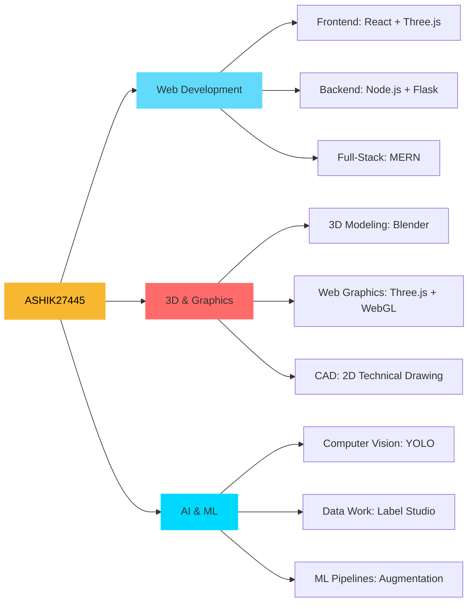

<!-- 
╔══════════════════════════════════════════════════════════════════════╗
║                    ASHIK27445 • DIGITAL CRAFTSMAN                    ║
║              Where Code Meets Art • Innovation Meets Design          ║
╚══════════════════════════════════════════════════════════════════════╝
-->

<div align="center">

# ✦ ASHIK ✦

### Full-Stack Architect • 3D Artist • AI Engineer


</div>

```yaml
status:
  location: "Dhaka, Bangladesh 🇧🇩"
  timezone: "GMT+6"
  role: "Full-Stack Developer + 3D Enthusiast + ML Engineer"
  availability: "Open for Collaboration & Freelance"
  
current_mission:
  🔭 building: "Next-gen 3D Web Experiences with Three.js"
  🌱 learning: "Advanced Computer Vision & Neural Networks"
  👯 collaborating: "Open-Source Projects & Innovative Startups"
  🤔 exploring: "WebGPU, Shaders, and Real-time Graphics"
  💬 expertise: ["Full-Stack Dev", "Three.js", "YOLO", "MERN", "Blender"]
  📫 contact: "your.email@example.com"
  ⚡ vibe: "Turning caffeine into code since forever ☕"
```

---

## ⚡ TECH SPECTRUM

<table>
<tr>
<td valign="top" width="33%">

### 🎨 Frontend Universe
```javascript
const frontend = {
  core: ['HTML5', 'CSS3', 'JavaScript'],
  frameworks: ['React', 'Next.js'],
  styling: ['Tailwind', 'DaisyUI'],
  graphics: ['Three.js', 'WebGL'],
  motion: ['GSAP', 'Framer Motion']
}
```

</td>
<td valign="top" width="33%">

### ⚙️ Backend Realm
```python
backend = {
    'runtime': ['Node.js', 'Deno'],
    'frameworks': ['Express', 'Flask'],
    'databases': ['MongoDB', 'MySQL', 'Firebase'],
    'apis': ['REST', 'GraphQL'],
    'auth': ['JWT', 'OAuth']
}
```

</td>
<td valign="top" width="33%">

### 🤖 AI/ML Domain
```python
ml_stack = {
    'vision': ['YOLO', 'OpenCV'],
    'tools': ['Label Studio', 'Roboflow'],
    'frameworks': ['TensorFlow', 'PyTorch'],
    'processing': ['NumPy', 'Pandas'],
    'augmentation': ['Albumentations']
}
```

</td>
</tr>
</table>

<details>
<summary><b>📦 Full Technology Stack</b></summary>

<br/>

**Languages**  


**Frontend & 3D**  


**Backend & Databases**  


**AI/ML & Vision**  


**Design & 3D Tools**  


**DevOps & Tools**  


</details>

---

## 📊 PERFORMANCE METRICS

<div align="center">


</div>

---

## 🎯 EXPERTISE MATRIX



---

## 🚀 FEATURED WORK

<div align="center">

| 🌟 Project | 📝 Description | 🛠️ Stack | 🔗 Link |
|:-----------|:---------------|:----------|:--------|
| **3D Web Portfolio** | Immersive portfolio with interactive 3D elements | Three.js • React • GSAP | [→](#) |
| **AI Vision System** | Real-time object detection dashboard | YOLO • Flask • React | [→](#) |
| **E-Commerce Platform** | Full-featured shopping experience | MERN • Stripe • JWT | [→](#) |
| **Data Labeling Tool** | Custom annotation platform for ML datasets | Label Studio • Python | [→](#) |

<a href="https://github.com/ASHIK27445">
  
</a>
<a href="https://github.com/ASHIK27445">
  
</a>

</div>

---

## 🎨 WHAT I BRING TO THE TABLE

<table>
<tr>
<td width="50%">

**💻 Development Excellence**
- Clean, maintainable, scalable code
- Modern architecture & best practices
- Performance optimization expertise
- Cross-browser compatibility
- Responsive design mastery

</td>
<td width="50%">

**🎯 Problem Solving**
- Complex algorithm implementation
- System design & architecture
- Database optimization
- API design & integration
- Real-time application development

</td>
</tr>
<tr>
<td width="50%">

**🌐 3D & Visual Computing**
- Interactive 3D web experiences
- WebGL shader programming
- 3D model optimization
- Real-time rendering techniques
- CAD drawing & technical design

</td>
<td width="50%">

**🤖 AI/ML Implementation**
- Computer vision solutions
- Object detection & tracking
- Data annotation pipelines
- Model training & deployment
- Dataset preparation & augmentation

</td>
</tr>
</table>

---

## 🏆 ACHIEVEMENTS & MILESTONES

<div align="center">


</div>

---

## 💼 LET'S BUILD SOMETHING AMAZING

<div align="center">

I'm passionate about creating innovative solutions that make a difference. Whether it's a stunning web experience, a complex ML pipeline, or an immersive 3D application – I'm here to bring ideas to life.

**🤝 Open For:**
- Freelance Projects
- Open-Source Collaboration  
- Technical Consulting
- Innovative Partnerships

### 📬 Connect With Me

[](YOUR_PORTFOLIO_URL)
[](YOUR_LINKEDIN_URL)
[](mailto:YOUR_EMAIL)
[](YOUR_TWITTER_URL)

<br/>


</div>

---

<div align="center">

**💡 "Code is poetry written in logic"**

<sub>Built with ❤️ by ASHIK27445 • Last updated: 2025</sub>

</div>
