```mermaid
mindmap
  root((💎 EXPERTISE 💎))
    🌐 Web Development
      Frontend Architecture
        React Ecosystems
        Three.js Mastery
        Responsive Design
      Backend Systems
        RESTful APIs
        Real-time Apps
        Microservices
      Full-Stack Magic
        MERN Stack
        Authentication
        Database Design
    🤖 AI & Machine Learning
      Computer Vision
        Object Detection
        YOLO Models
        Image Classification
      Data Engineering
        Annotation Pipelines
        Label Studio
        Data Augmentation
      ML Operations
        Model Training
        Dataset Preparation
        Performance Tuning
    🎨 3D & Design
      3D Modeling
        Blender Workflows
        Asset Creation
        UV Mapping
      CAD Engineering
        2D Technical Drawings
        Precision Design
      Web Integration
        WebGL Optimization
        Three.js Scenes
        Performance Magic
    🔬 Advanced Tech
      System Programming
        C/C++ Applications
        Memory Management
      Enterprise Java
        Spring Framework
        Scalable Systems
      Python Automation
        Flask APIs
        Data Science
```

<div align="center">

<!-- EPIC ANIMATED HEADER -->


</div>

<!-- GLITCH EFFECT TITLE -->
<h1 align="center">
  
</h1>

<!-- DYNAMIC BIO SECTION -->
<p align="center">
  
</p>

<!-- STUNNING STATS BANNER -->
<div align="center">
  
</div>

<br/>

<!-- MATRIX STYLE SEPARATOR -->


<!-- ABOUT SECTION WITH CYBERPUNK THEME -->
<details open>
<summary><h2>🌌 WHO AM I? - DECODING THE DEVELOPER</h2></summary>

<br/>


### 📡 TRANSMISSION INCOMING...

```python
class Developer:
    def __init__(self):
        self.name = "Your Name"
        self.role = "Full-Stack Architect"
        self.language_spoken = ["en_US", "bn_BD", "Binary"]
        self.location = "Dhaka, Bangladesh 🇧🇩"
        
    def current_status(self):
        return {
            "🔭 working_on": "Building the Matrix IRL",
            "🌱 learning": "Quantum Computing & Neural Networks",
            "👯 collaborate_on": "Revolutionary Open Source Projects",
            "🤔 help_with": "Scaling WebGL to Infinity",
            "💬 ask_me_about": ["MERN", "Three.js", "YOLO", "Life, Universe & Code"],
            "📫 reach_me": "your.email@quantum.dev",
            "😄 pronouns": "He/Him/Hacker",
            "⚡ fun_fact": "I once debugged a quantum computer... in my sleep"
        }
    
    @property
    def code_philosophy(self):
        return "Clean code is not written by following rules. \
                It's written by passionate developers with discipline."
    
    def say_hi(self):
        print("Thanks for dropping by! Let's build something extraordinary! 🚀")

me = Developer()
me.say_hi()
```

<br clear="right"/>

</details>

<!-- MATRIX SEPARATOR -->


<!-- TECH STACK GALAXY -->
<details open>
<summary><h2>⚡ TECH ARSENAL - THE INFINITY GAUNTLET</h2></summary>

<br/>

<!-- FRONTEND UNIVERSE -->
<div align="center">

### 🎨 FRONTEND COSMOS

<table>
<tr>
<td align="center" width="96">
  
  <br>HTML5
</td>
<td align="center" width="96">
  
  <br>CSS3
</td>
<td align="center" width="96">
  
  <br>JavaScript
</td>
<td align="center" width="96">
  
  <br>React
</td>
<td align="center" width="96">
  
  <br>Three.js
</td>
<td align="center" width="96">
  
  <br>Tailwind
</td>
</tr>
</table>

### ⚙️ BACKEND DIMENSION

<table>
<tr>
<td align="center" width="96">
  
  <br>Node.js
</td>
<td align="center" width="96">
  
  <br>Express
</td>
<td align="center" width="96">
  
  <br>Flask
</td>
<td align="center" width="96">
  
  <br>MongoDB
</td>
<td align="center" width="96">
  
  <br>MySQL
</td>
<td align="center" width="96">
  
  <br>Firebase
</td>
</tr>
</table>

### 💻 PROGRAMMING MATRIX

<table>
<tr>
<td align="center" width="96">
  
  <br>C
</td>
<td align="center" width="96">
  
  <br>C++
</td>
<td align="center" width="96">
  
  <br>Java
</td>
<td align="center" width="96">
  
  <br>Python
</td>
<td align="center" width="96">
  
  <br>TypeScript
</td>
</tr>
</table>

### 🤖 AI/ML NEURAL NETWORK

<table>
<tr>
<td align="center" width="96">
  
  <br>TensorFlow
</td>
<td align="center" width="96">
  
  <br>OpenCV
</td>
<td align="center" width="96">
  
  <br>NumPy
</td>
<td align="center" width="96">
  
  <br>Pandas
</td>
<td align="center" width="96">
  
  <br>Scikit
</td>
</tr>
</table>

### 🎨 DESIGN & 3D REALM

<table>
<tr>
<td align="center" width="96">
  
  <br>Blender
</td>
<td align="center" width="96">
  
  <br>Figma
</td>
<td align="center" width="96">
  
  <br>AutoCAD
</td>
<td align="center" width="96">
  
  <br>Photoshop
</td>
</tr>
</table>

### 🛠️ DEVELOPER TOOLS

<table>
<tr>
<td align="center" width="96">
  
  <br>Git
</td>
<td align="center" width="96">
  
  <br>GitHub
</td>
<td align="center" width="96">
  
  <br>VS Code
</td>
<td align="center" width="96">
  
  <br>Docker
</td>
<td align="center" width="96">
  
  <br>Postman
</td>
<td align="center" width="96">
  
  <br>Linux
</td>
</tr>
</table>

</div>

</details>

<!-- SEPARATOR -->


<!-- EXPERTISE CONSTELLATION -->
<details open>
<summary><h2>🌠 EXPERTISE CONSTELLATION</h2></summary>

<br/>

<div align="center">



</div>

</details>

<!-- SEPARATOR -->


<!-- GITHUB STATS NEXUS -->
<details open>
<summary><h2>📊 THE STATS NEXUS - PERFORMANCE METRICS</h2></summary>

<br/>

<div align="center">

<!-- DYNAMIC STATS CARDS -->
<a href="https://github.com/YOUR_USERNAME">
  
</a>
<a href="https://github.com/YOUR_USERNAME">
  
</a>

<!-- STREAK STATS -->


<!-- 3D CONTRIBUTION GRAPH -->


<!-- TROPHY SHOWCASE -->


<!-- PRODUCTIVITY STATS -->


</div>

</details>

<!-- SEPARATOR -->


<!-- PROJECTS GALAXY -->
<details open>
<summary><h2>🚀 PROJECT GALAXY - FEATURED CREATIONS</h2></summary>

<br/>

<div align="center">

<!-- PROJECT CARDS -->
<a href="https://github.com/YOUR_USERNAME/PROJECT_1">
  
</a>
<a href="https://github.com/YOUR_USERNAME/PROJECT_2">
  
</a>

<a href="https://github.com/YOUR_USERNAME/PROJECT_3">
  
</a>
<a href="https://github.com/YOUR_USERNAME/PROJECT_4">
  
</a>

</div>

### 🎯 PROJECT SHOWCASE

| 🌟 Project | 💡 Description | 🛠️ Tech Stack | 🔗 Links |
|-----------|---------------|---------------|----------|
| **3D Portfolio Universe** | Immersive 3D portfolio with physics engine | Three.js, React, GSAP | [Live](https://your-link.com) • [Code](https://github.com/YOUR_USERNAME) |
| **AI Vision Dashboard** | Real-time object detection dashboard | YOLO, Flask, React | [Live](https://your-link.com) • [Code](https://github.com/YOUR_USERNAME) |
| **Neural Art Generator** | AI-powered art generation platform | TensorFlow, Node.js | [Live](https://your-link.com) • [Code](https://github.com/YOUR_USERNAME) |
| **Quantum Task Manager** | Next-gen task management with AI | MERN, OpenAI API | [Live](https://your-link.com) • [Code](https://github.com/YOUR_USERNAME) |

</details>

<!-- SEPARATOR -->


<!-- CONTRIBUTION SNAKE -->
<details open>
<summary><h2>🐍 CONTRIBUTION SNAKE - EATING MY COMMITS</h2></summary>

<br/>

<div align="center">
  
</div>

</details>

<!-- SEPARATOR -->


<!-- BLOG & WRITING -->
<details>
<summary><h2>📝 LATEST BLOG POSTS & WRITINGS</h2></summary>

<br/>

<!-- BLOG-POST-LIST:START -->
- 🔥 [How I Built a 3D Web Experience with Three.js and React](https://your-blog.com)
- 🤖 [YOLO Object Detection: From Zero to Hero](https://your-blog.com)
- 🌐 [Mastering the MERN Stack in 2024](https://your-blog.com)
- ⚡ [WebGL Performance Optimization Techniques](https://your-blog.com)
- 💡 [The Art of Clean Code: A Developer's Philosophy](https://your-blog.com)
<!-- BLOG-POST-LIST:END -->

</details>

<!-- SEPARATOR -->


<!-- ACHIEVEMENTS & CERTIFICATIONS -->
<details>
<summary><h2>🏆 ACHIEVEMENTS & CERTIFICATIONS</h2></summary>

<br/>

<div align="center">

| 🎖️ Achievement | 🌟 Details | 📅 Year |
|---------------|-----------|---------|
| **Full-Stack Certified** | MongoDB, Express, React, Node.js | 2024 |
| **AWS Cloud Practitioner** | Amazon Web Services | 2024 |
| **TensorFlow Developer** | Google TensorFlow Certification | 2024 |
| **Three.js Master** | Advanced 3D Web Graphics | 2023 |
| **YOLO Specialist** | Computer Vision & Object Detection | 2023 |
| **Hackathon Winner** | National Coding Competition | 2023 |

</div>

</details>

<!-- SEPARATOR -->


<!-- SUPPORT & SPONSOR -->
<details>
<summary><h2>💖 SUPPORT MY WORK</h2></summary>

<br/>

<div align="center">

If you find my work valuable and want to support my open-source contributions:

[](https://buymeacoffee.com/YOUR_USERNAME)
[](https://paypal.me/YOUR_USERNAME)
[](https://patreon.com/YOUR_USERNAME)
[](https://ko-fi.com/YOUR_USERNAME)

**Your support helps me:**
- 🚀 Build more open-source projects
- 📚 Create educational content
- 💡 Experiment with cutting-edge tech
- ☕ Stay caffeinated while coding

</div>

</details>

<!-- SEPARATOR -->


<!-- CONNECT SECTION -->
<h2 align="center">🌐 LET'S CONNECT & COLLABORATE</h2>

<div align="center">

### 📡 Find Me Across The Digital Universe

<a href="YOUR_LINKEDIN_URL">
  
</a>
<a href="YOUR_TWITTER_URL">
  
</a>
<a href="YOUR_PORTFOLIO_URL">
  
</a>
<a href="mailto:YOUR_EMAIL">
  
</a>

<a href="YOUR_DISCORD">
  
</a>
<a href="YOUR_TELEGRAM">
  
</a>
<a href="YOUR_MEDIUM_URL">
  
</a>
<a href="YOUR_DEVTO_URL">
  
</a>

<a href="YOUR_STACKOVERFLOW_URL">
  
</a>
<a href="YOUR_CODEPEN_URL">
  
</a>
<a href="YOUR_LEETCODE_URL">
  
</a>
<a href="YOUR_YOUTUBE_URL">
  
</a>

<br/><br/>

### 🎯 Quick Stats


</div>

<!-- SEPARATOR -->


<!-- QUOTES SECTION -->
<div align="center">

### 💭 WISDOM FROM THE CODE


</div>

<!-- SEPARATOR -->


<!-- MUSIC SECTION -->
<div align="center">

### 🎵 CODING SOUNDTRACK

[](https://open.spotify.com/user/YOUR_SPOTIFY_ID)

*Currently vibing to: Lo-fi Beats & Synthwave* 🎧

</div>

<!-- SEPARATOR -->


<!-- FOOTER -->
<div align="center">

### 🌟 "In a world of 1s and 0s, be the bug that breaks the system" 🌟

<br/>

```ascii
╔═══════════════════════════════════════════════════════════════╗
║                                                               ║
║   ██████╗  ██████╗ ██████╗ ██╗███╗   ██╗ ██████╗            ║
║  ██╔════╝ ██╔═══██╗██╔══██╗██║████╗  ██║██╔════╝            ║
║  ██║      ██║   ██║██║  ██║██║██╔██╗ ██║██║  ███╗           ║
║  ██║      ██║   ██║██║  ██║██║██║╚██╗██║██║   ██║           ║
║  ╚██████╗ ╚██████╔╝██████╔╝██║██║ ╚████║╚██████╔╝           ║
║   ╚═════╝  ╚═════╝ ╚═════╝ ╚═╝╚═╝  ╚═══╝ ╚═════╝            ║
║                                                               ║
║              "Where Imagination Meets Implementation"         ║
║                                                               ║
╚═══════════════════════════════════════════════════════════════╝
```

<br/>

**💼 Open for Freelance Projects | 🤝 Collaboration | 💡 Consulting**

<br/>


</div>

<!-- GITHUB METADATA -->
<div align="center">
  
</div>

---

<div align="center">
  <sub>⭐️ From <a href="https://github.com/YOUR_USERNAME">YOUR_USERNAME</a> with 💙 and ☕</sub>
</div>
