  
### 👋 Hey there, I'm **Ashik**

---

<!-- TECH STACK GALAXY -->

<h2>⚡ TECH ARSENAL - THE INFINITY GAUNTLET</h2>

 

<!-- FRONTEND UNIVERSE -->

### 🎨 FRONTEND COSMOS

<table>
<tr>
<td align="center" width="96">
  
   HTML5
</td>
<td align="center" width="96">
  
   CSS3
</td>
<td align="center" width="96">
  
   JavaScript
</td>
<td align="center" width="96">
  
   React
</td>
<td align="center" width="96">
  
   Three.js
</td>
<td align="center" width="96">
  
   Tailwind
</td>
</tr>
</table>

### ⚙️ BACKEND DIMENSION

<table>
<tr>
<td align="center" width="96">
  
   Node.js
</td>
<td align="center" width="96">
  
   Express
</td>
<td align="center" width="96">
  
   Flask
</td>
<td align="center" width="96">
  
   MongoDB
</td>
<td align="center" width="96">
  
   MySQL
</td>
<td align="center" width="96">
  
   Firebase
</td>
</tr>
</table>

### 💻 PROGRAMMING MATRIX

<table>
<tr>
<td align="center" width="96">
  
   C
</td>
<td align="center" width="96">
  
   C++
</td>
<td align="center" width="96">
  
   Java
</td>
<td align="center" width="96">
  
   Python
</td>
<td align="center" width="96">
  
   TypeScript
</td>
</tr>
</table>

### 🤖 AI/ML NEURAL NETWORK

<table>
<tr>
<td align="center" width="96">
  
   TensorFlow
</td>
<td align="center" width="96">
  
   OpenCV
</td>
<td align="center" width="96">
  
   NumPy
</td>
<td align="center" width="96">
  
   Pandas
</td>
<td align="center" width="96">
  
   Scikit
</td>
</tr>
</table>

### 🎨 DESIGN & 3D REALM

<table>
<tr>
<td align="center" width="96">
  
   Blender
</td>
<td align="center" width="96">
  
   Figma
</td>
<td align="center" width="96">
  
   AutoCAD
</td>
<td align="center" width="96">
  
   Photoshop
</td>
</tr>
</table>

### 🛠️ DEVELOPER TOOLS

<table>
<tr>
<td align="center" width="96">
  
   Git
</td>
<td align="center" width="96">
  
   GitHub
</td>
<td align="center" width="96">
  
   VS Code
</td>
<td align="center" width="96">
  
   Docker
</td>
<td align="center" width="96">
  
   Postman
</td>
<td align="center" width="96">
  
   Linux
</td>
</tr>
</table>

<!-- SEPARATOR -->

 

---

## 🎯 EXPERTISE CONSTELLATION

```mermaid
mindmap
  root((🚀 ASHIK27445))
    🌐 Web Development
      Frontend Magic
        React & Next.js
        Three.js 3D
        Responsive Design
        UI/UX Excellence
      Backend Power
        Node.js & Express
        RESTful APIs
        Real-time Apps
        Database Design
      Full-Stack Mastery
        MERN Stack
        Authentication
        Deployment
        Optimization
    🤖 AI & Machine Learning
      Computer Vision
        YOLO Detection
        Object Tracking
        Image Classification
        OpenCV Magic
      Data Engineering
        Label Studio Pro
        Data Augmentation
        Dataset Preparation
        Pipeline Building
      ML Operations
        Model Training
        Deployment
        Performance Tuning
        Production Ready
    🎨 3D & Design
      3D Modeling
        Blender Artistry
        Asset Creation
        UV Mapping
        Texturing
      Web Graphics
        WebGL Mastery
        Three.js Scenes
        Shader Programming
        Real-time Rendering
      Technical Design
        2D CAD Drawing
        Precision Work
        Technical Specs
```

 

## 🐍 WATCH MY COMMITS GET EATEN!

  

### 🎯 Current Focus & Interests

- 🔭 I'm currently working on **[Your Current Project - e.g., Building a 3D Portfolio Website with Three.js]**
- 🌱 I'm currently learning **[What You're Learning - e.g., Advanced YOLO Models & WebGL Shaders]**
- 👯 I'm looking to collaborate on **[Collaboration Interests - e.g., Open-source 3D Web Projects & AI/ML Tools]**
- 🤔 I'm looking for help with **[What You Need Help With - e.g., Optimizing Three.js Performance]**
- 💬 Ask me about **Web Development, Three.js, React, MERN Stack, YOLO, Data Annotation, or anything tech!**
- 📫 How to reach me: **your.email@example.com** or connect via socials below
- 😄 Pronouns: **He/Him** (or Your Pronouns)
- ⚡ Fun fact: **I can debug code faster than I can find my keys in the morning! ☕**

---

### 📊 GitHub Analytics

  
  

  
  

---

### 🏆 GitHub Trophies

  

---

### 🌟 Featured Projects

---

### 📈 Contribution Activity

  

---

### 🤝 Let's Connect & Collaborate

---

